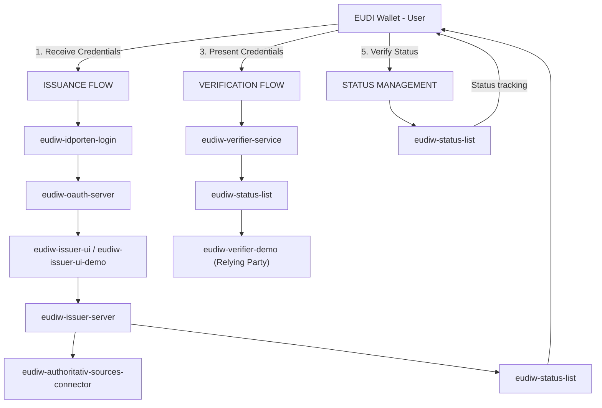
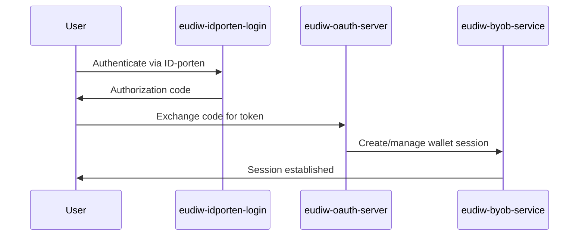
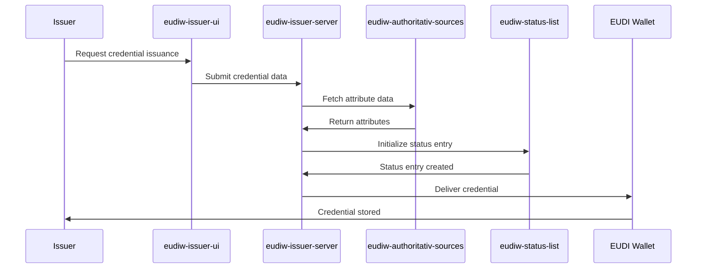
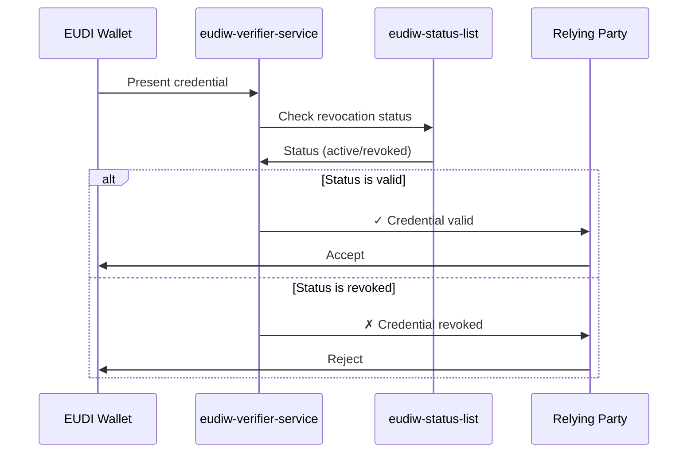
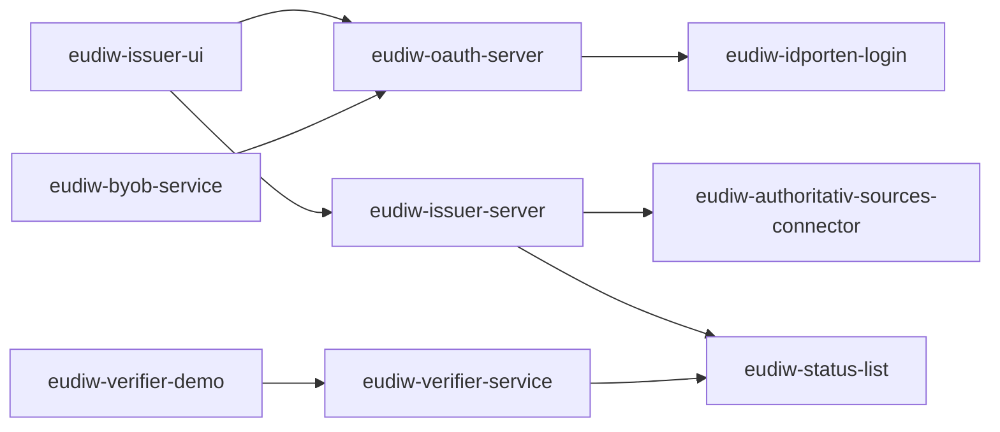
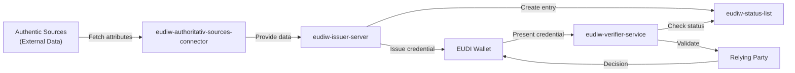

# Application Flow and Interaction

Diagrams showing how applications interact in the system.

## High-Level Flow

## Authentication & Session Flow

## Credential Issuance Flow

## Credential Verification Flow

## Service Dependency Graph

## Data Flow Through System

---

## See Also

- [EUDI_ROLES.md](./EUDI_ROLES.md) - Role details and components

