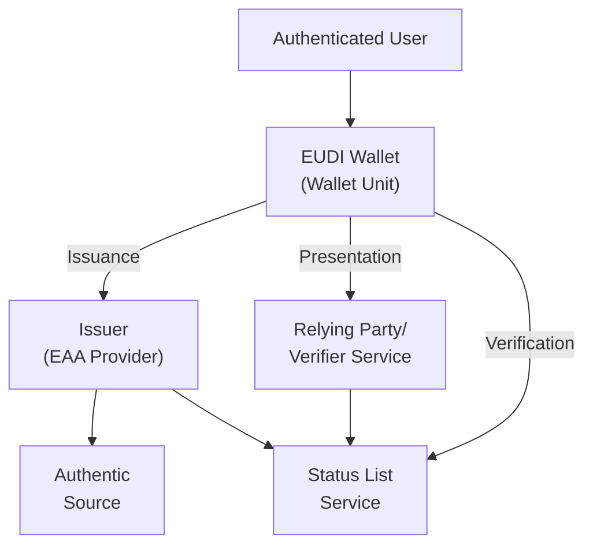

# EUDI Roles in eudiw-bevisporten

This project implements EUDI Wallet roles as defined in the [European Digital Identity Regulation](https://eur-lex.europa.eu/legal-content/EN/TXT/HTML/?uri=OJ:L_202401183).

## Quick Summary

- **Wallet Provider** - Certified EUDI Wallet solution
- **Issuer (EAA Provider)** - Issues electronic attestations
- **Authentic Source** - Authoritative attribute sources
- **Relying Party** - Verifies presented attestations
- **Status List Provider** - Manages attestation status
- **Login Service** - User authentication via ID-porten

See [ARF documentation](https://eudi.dev/latest/main/03-roles-within-the-eudi-wallet-ecosystem/) for all roles.

---

## Roles in this project

### 1. **Wallet Provider**
Offers certified EUDI Wallet solution to users.

**Components:** `eudiw-issuer-server`, `eudiw-byob-service`, `eudiw-oauth-server`

**Responsibilities:** Wallet certification, user control over credentials, cryptographic key management

---

### 2. **Issuer** (EAA Provider)
Issues electronic attestations of attributes.

**Components:** `eudiw-issuer-ui`, `eudiw-issuer-server`, `eudiw-issuer-ui-demo`

**Responsibilities:** Verify and issue attestations, integrate with authentic sources, maintain status

---

### 3. **Authentic Source**
Authoritative source for attributes to be attested.

**Components:** `eudiw-authoritativ-sources-connector`

**Responsibilities:** Provide attribute data, integrate with external data systems

---

### 4. **Relying Party** (Verifier)
Verifies and receives attestations from the Wallet.

**Components:** `eudiw-verifier-service`, `eudiw-verifier-demo`

**Responsibilities:** Validate presented attestations, verify authenticity, handle information securely

---

### 5. **Status List Provider**
Manages status of issued attestations.

**Components:** `eudiw-status-list`

**Responsibilities:** Track attestation status, enable revocation/deactivation, publish status

---

### 6. **Login Service**
Handles user authentication.

**Components:** `eudiw-idporten-login`

**Responsibilities:** User authentication, session management, token exchange

---

## Architecture Flow

---

## References

- [European Digital Identity Regulation](https://eur-lex.europa.eu/legal-content/EN/TXT/HTML/?uri=OJ:L_202401183)
- [ARF Documentation](https://eudi.dev/latest/main/03-roles-within-the-eudi-wallet-ecosystem/)
- [National Sandbox](https://docs.digdir.no/docs/lommebok/lommebok_om.html)

